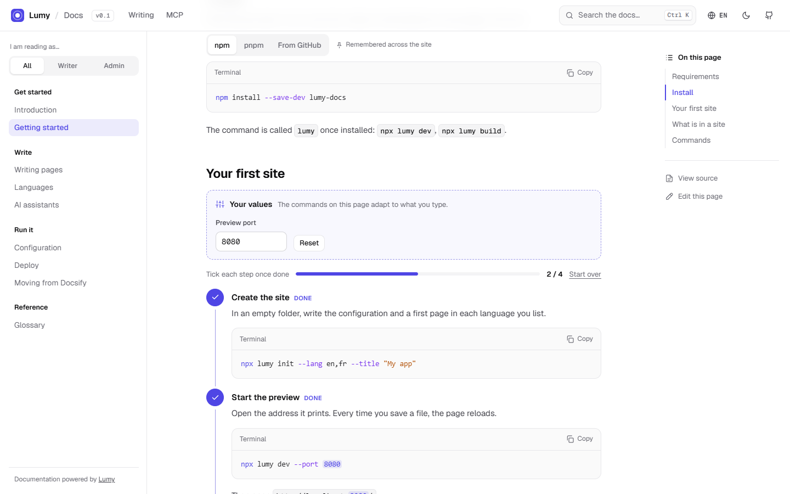

<p align="center">
  
</p>

<h1 align="center">Lumy</h1>

<p align="center">Light, multilingual, interactive documentation. Write Markdown, get a fast static site.</p>

<p align="center"><strong>English</strong> · <a href="README.fr.md">Français</a></p>

<p align="center">
  
</p>

---

Lumy turns a folder of Markdown files into a documentation site that loads at once, reads well on a phone, speaks several languages, and helps readers do what the page describes.

- **Light.** Plain HTML built ahead of time, one stylesheet, one small script. No framework in the browser, nothing from a third-party CDN, one dependency at build time.
- **Easy to change.** Pages are Markdown; navigation, languages and colours live in `lumy.config.json`.
- **Multilingual.** One folder per language. Readers land in their language and keep their place when they switch; untranslated pages fall back to the source language, and translations that fell behind their source are flagged.
- **Interactive.** Blocks that make readers act: steps to tick, tabs remembered site-wide, the reader's own values inside commands, annotated screenshots, quizzes, a glossary on hover, search with typo tolerance (Ctrl K).
- **Open to AI.** `lumy mcp` lets Claude, or any MCP client, read and write the docs; every site publishes `llms.txt` and each page as Markdown.
- **Smooth.** Every interaction animates, and all motion stops for readers who ask their system for less.
- **No account to read. Ever.**

## Quick start

```bash
npm install --save-dev lumy-docs     # or: npm install --save-dev github:PetitOursManu/Lumy
npx lumy init --lang en,fr --title "My app"
npx lumy dev
```

Then edit `docs/en/index.md`. `npx lumy build` writes the site to `dist/`.

## A page

```md
---
title: Install
description: Get it running in five minutes.
---

:::vars
port = 8080 | Port
:::

:::steps id=install
1. **Start the container.**
   ```bash
   docker run -p {{port}}:8080 my-app
   ```
2. **Open it.** Go to `http://localhost:{{port}}`.
:::

:::why Why port 8080?
Because ports below 1024 need extra rights on most systems.
:::
```

Every block is described, with a live example, in the documentation: [`site/docs/en/writing.md`](site/docs/en/writing.md).

## Commands

| Command | What it does |
|---|---|
| `lumy init [folder]` | Creates a site |
| `lumy dev` | Preview with live reload |
| `lumy build` | Writes the static site to `dist/` |
| `lumy serve` | Serves `dist/` and stores reader feedback |
| `lumy check` | Reports broken links, missing images, unknown blocks, outdated translations |
| `lumy translations [--stamp]` | Translation status; `--stamp` marks translations current |
| `lumy mcp` | MCP server for AI assistants (stdio) |
| `lumy import docsify <folder>` | Converts a Docsify site |

## Documentation

Lumy's documentation is written with Lumy, in English and French, in [`site/`](site/):

```bash
npm run dev        # then open http://localhost:4000
```

## Development

```bash
npm install
npm test               # node:test, no other tool
npm run dev        # Lumy's own docs, with live reload
```

The code is small on purpose: `src/` holds the build (Markdown, pages, search, languages, MCP), `theme/` the stylesheet and the reader-side script. `maquette/` keeps the first mock-up the design came from.

## Licence

MIT. The Geist fonts in `theme/fonts/` are under the SIL Open Font License (`theme/fonts/OFL.txt`).
